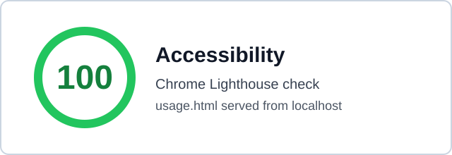

# Anagram Checker

This project checks whether two strings are anagrams of each other.

An **anagram** means two strings contain the same characters in a different order — for example, `listen` and `silent`.

The checker can also ignore spaces, punctuation, and letter case depending on its config-style settings.

---

## Main idea

Before comparing the strings, we clean them.

Cleaning means:

1. Remove characters we want to ignore.
2. Apply a case rule, such as exact matching or Unicode-friendly case-insensitive matching.
3. Compare character counts.

---

## Config-style settings

In this simple version, we do not use a real config file. Instead, we use functions that pretend to read from config — one returns the set of characters to ignore, another returns the name of the case rule to apply.

The config returns simple text like `casefold`, and the program maps that text to the actual behavior. This indirection means the comparison logic doesn't have to know about every possible mode — it just looks up the rule it was told to use.

---

## Why use casefold

`casefold` is like a stronger version of `lower`.

For normal English letters they usually behave the same, but `casefold` is better for Unicode text — for example, the German sharp-s character is normalized to a form that matches its uppercase spelling. With the casefold rule, `Straße` and `STRASSE` are treated as anagrams. With the exact rule, they would not match, because the characters are compared as written.

---

## Counting approaches

There are three common ways to check whether two cleaned strings are anagrams.

### Sorting with `sorted`

Sort both strings and compare the results. `sorted` is a Python built-in, so nothing needs to be imported. Simple to read, but does more work than necessary because sorting is `O(n log n)`.

### Two frequency tables with `Counter`

Build a character-count table for each string and compare the two tables. The standard way to do this in Python is `Counter`, which lives in the `collections` module and must be imported before use. Easy to read and `O(n)` in time, but stores counts for both strings at once.

### One frequency table, built by hand

Build a count table for the first string, then walk through the second string decrementing counts. If a character is missing or its count has already reached zero, the strings differ. Same `O(n)` time, but only one table in memory, and uses nothing beyond plain dictionaries — no imports needed.

---

## Complexity at a glance

Let `n` be the length of the cleaned strings and `k` the number of unique characters.

| Approach        | Time         | Space                       |
|-----------------|--------------|-----------------------------|
| `sorted`        | `O(n log n)` | `O(n)`                      |
| `Counter` ×2    | `O(n)`       | `O(n + k)`                  |
| One table       | `O(n)`       | `O(n + k)`, one fewer table |

For typical strings the differences are small. For very large inputs, the one-table version is the most economical.

---

## Which version should you use?

- **`Counter`** when readability matters most and you don't mind the import.
- **One table** when you want explicit control over the algorithm or are working with very large strings.
- **`sorted`** only when the input is small and you want the shortest explanation.

For learning, the one-table version is the most useful — it shows exactly what `Counter` is doing under the hood, which is the core idea behind every anagram check.

---

## Accessibility for `usage.html`

The project includes an HTML usage page at [`usage.html`](usage.html). It was written as a semantic, static help page so it can be checked with browser accessibility tools.

The page was checked in Chrome Lighthouse over `http://localhost:8000/anagram_check/usage.html` and received an Accessibility score of `100`.



The automated Lighthouse result is useful, but it does not prove full WCAG compliance. Automated tools only catch a subset of accessibility issues.

Manual checks that should still be performed:

- Use the keyboard only and press `Tab` through the page.
- Confirm the skip link appears on focus and moves to the main content.
- Confirm focus order follows the visual reading order.
- Confirm every focused link has a visible focus indicator.
- Confirm navigation links move to the expected sections.
- Read the page with a screen reader such as VoiceOver on macOS.
- Confirm the page makes sense without relying on layout, color, or emoji.
- Confirm command examples and option descriptions are understandable.

Helpful commands:

```bash
python3 -m http.server 8000
```

```bash
python3 -m html.parser anagram_check/usage.html
```

```bash
python3 -m unittest discover -s anagram_check
```
